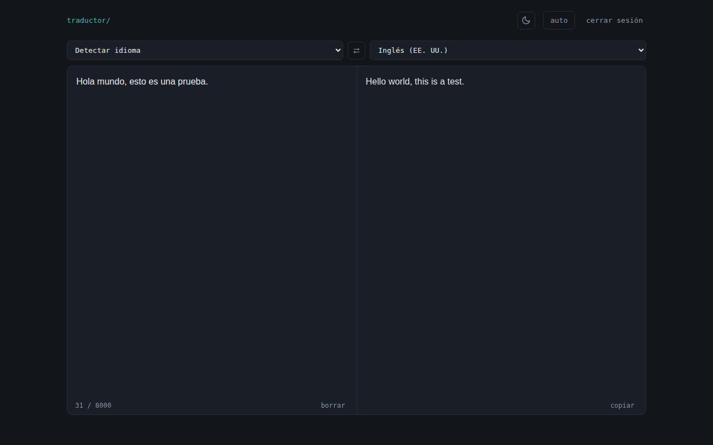

# TraductorYa

Traductor personal (estilo DeepL) construido con HTML/CSS/JS vanilla y
funciones serverless de Vercel. Usa la API de DeepSeek para traducir texto
entre 12 idiomas. Protegido con login por contraseña, sin frameworks ni paso
de build.



## Características

- Login por contraseña con sesión firmada por cookie (`HttpOnly` + `Secure` +
  `SameSite=Strict`), válida 30 días.
- Traducción de hasta 8000 caracteres entre 12 idiomas (o con detección
  automática del idioma de origen), vía la API de DeepSeek.
- Traducción por streaming: el texto aparece progresivamente en vez de
  esperar a la respuesta completa.
- Modo automático (traduce 500ms después de dejar de escribir) o manual
  (solo al pulsar "traducir"), con la preferencia guardada en el navegador.
- Intercambiar idiomas de origen/destino con un clic, manteniendo el texto.
- Copiar la traducción y contador de caracteres.
- Rate limiting en el login: 5 intentos fallidos por IP bloquean 15 minutos.

## Estructura

```
index.html            Interfaz de login + traducción
api/auth.js            Valida la contraseña, aplica rate limiting y emite la cookie de sesión
api/check.js            Comprueba la sesión actual / cierra sesión
api/translate.js        Traduce el texto vía DeepSeek (requiere sesión válida)
api/_auth-utils.js      Helpers de firma/verificación de la cookie (HMAC, sin dependencias)
api/_rate-limit.js      Contador en memoria de intentos de login fallidos por IP
```

## Desarrollo local

Requiere Node 18+ y el [CLI de Vercel](https://vercel.com/docs/cli).

```bash
npm i -g vercel
vercel link          # vincula esta carpeta a un proyecto de Vercel
cp .env.example .env  # rellena AUTH_PASSWORD, SESSION_SECRET y DEEPSEEK_API_KEY
vercel dev
```

Abre `http://localhost:3000`. `vercel link` también genera `.env.local`
(token OIDC de Vercel) — ambos archivos `.env*` quedan fuera del repo por el
`.gitignore`, salvo `.env.example`, que sí es la plantilla a subir.

## Despliegue en Vercel

1. Sube este repo a GitHub (puede ser público: no hay secretos en el código,
   solo viven en variables de entorno).
2. Impórtalo en [vercel.com](https://vercel.com/new).
3. En **Project Settings → Environment Variables**, añade:

   | Variable | Descripción |
   |---|---|
   | `AUTH_PASSWORD` | La contraseña que pedirá el login |
   | `SESSION_SECRET` | String aleatorio largo para firmar las cookies (`openssl rand -hex 32`) |
   | `DEEPSEEK_API_KEY` | Tu API key de [platform.deepseek.com](https://platform.deepseek.com) |

4. Despliega. No compartas la URL de `*.vercel.app` que te asigna Vercel —
   es lo único que mantiene esto "privado" además del login.

## Notas de seguridad

- La contraseña y las API keys viven solo en variables de entorno, nunca en
  el código — por eso el repo puede ser público con seguridad.
- La sesión se guarda en una cookie `HttpOnly` + `Secure`, firmada con HMAC,
  no accesible desde JavaScript del navegador.
- La contraseña se compara con `crypto.timingSafeEqual` para evitar timing
  attacks.
- El endpoint `/api/translate` rechaza cualquier petición sin sesión válida,
  así que aunque alguien descubra la URL no puede gastar tu cuota de API sin
  la contraseña.
- El rate limiting del login (ver `api/_rate-limit.js`) es en memoria y
  *best-effort*: no persiste entre cold starts ni se comparte entre
  instancias concurrentes de la función. Frena scripts de fuerza bruta
  ingenuos, no un ataque distribuido — para eso, considera las reglas de
  rate limiting del [Firewall de Vercel](https://vercel.com/docs/vercel-firewall/vercel-waf/rate-limiting)
  (de pago por uso).

## Licencia

[MIT](LICENSE)
